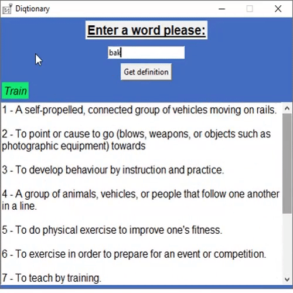
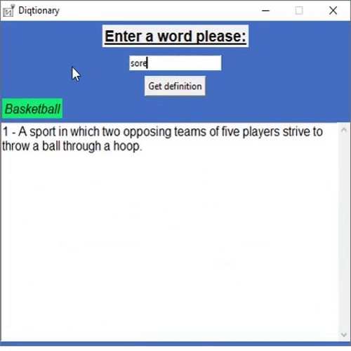
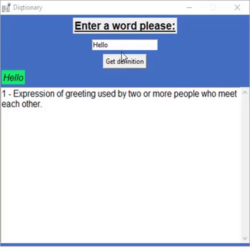
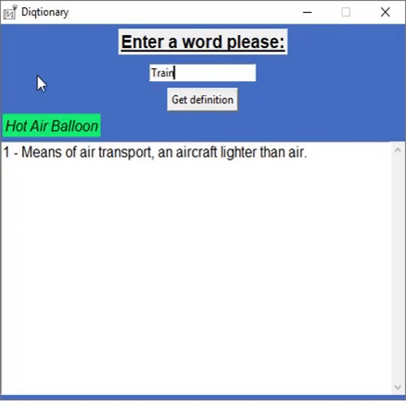
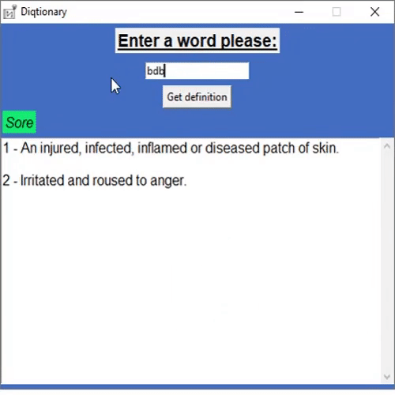

# Diqtionary
Diqtionary (a combination of "Dictionary" and "IQ") is a program that returns all the definitions of a given word. However, it also has some smart built-in features, which are showcased below.

## Demo
A spell check feature that provides possible words you might have meant if you input a word incorrectly:

Many options are shown to handle misspelled words:

Words with spaces are also read properly:

Words with many definitions are displayed in a scroll box.

Lets the user know when a word isn't in the dictionary.

## Getting Started
To run Diqtionary, download all the files and click on the "diqtionary.exe" executable in the "Program" directory.

## Built With
* [Tkinter](https://wiki.python.org/moin/TkInter) - Python GUI framework

## Acknowledgments
The inspiration behind this project was to give my little brother a tool to help him with his weekly spelling and definitions homework.
